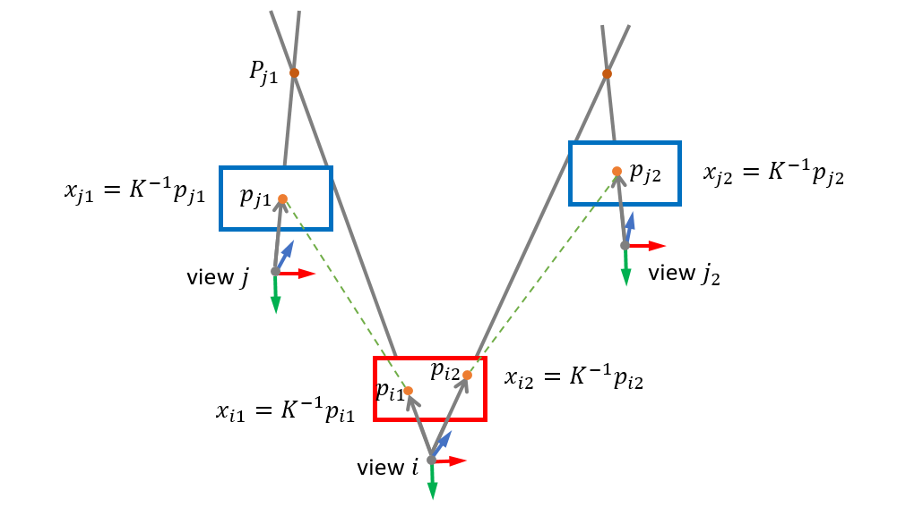
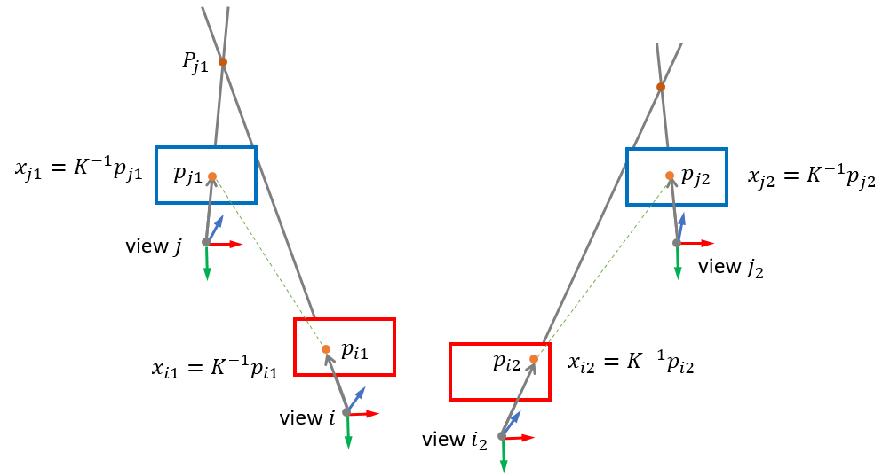

# 1P1DP
1P1DP and MC1P1DP minimal solution


## 1. Run

- run **benchmark_RANSACabsolute_pose_central.m** 

  to evaluate the 1P1DP with increasing 2D noise

- run **benchmark_RANSACabsolute_pose_MCnoncentral.m** 

  to evaluate MC1P1DP with increasing 2D noise

## 2. Correspondences in 1P1DP



support multiple reference images corresponding to one query image

## 3. Correspondences in MC1P1DP



support multiple query images

## 4. Reference

If you use this work for your research, please cite the respective paper:

```
@article{jiao2020robust,
  title={Robust localization for planar moving robot in changing environment: A perspective on density of correspondence and depth},
  author={Jiao, Yanmei and Liu, Lilu and Fu, Bo and Ding, Xiaqing and Wang, Minhang and Wang, Yue and Xiong, Rong},
  journal={arXiv preprint arXiv:2011.00439},
  year={2020}
}
```

video: https://www.youtube.com/watch?v=65O0hynGKNk